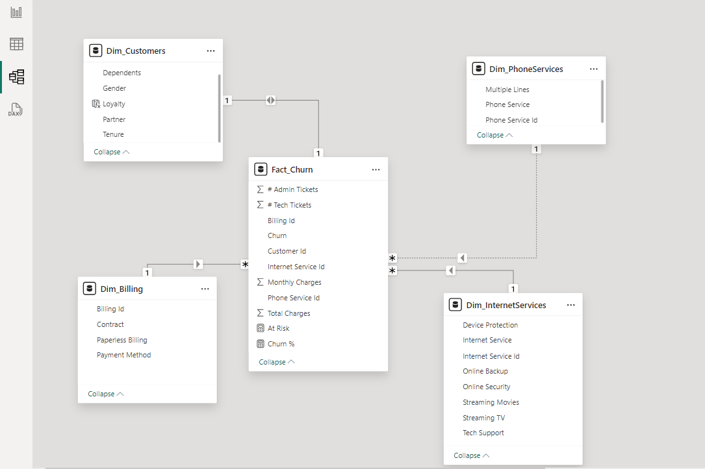
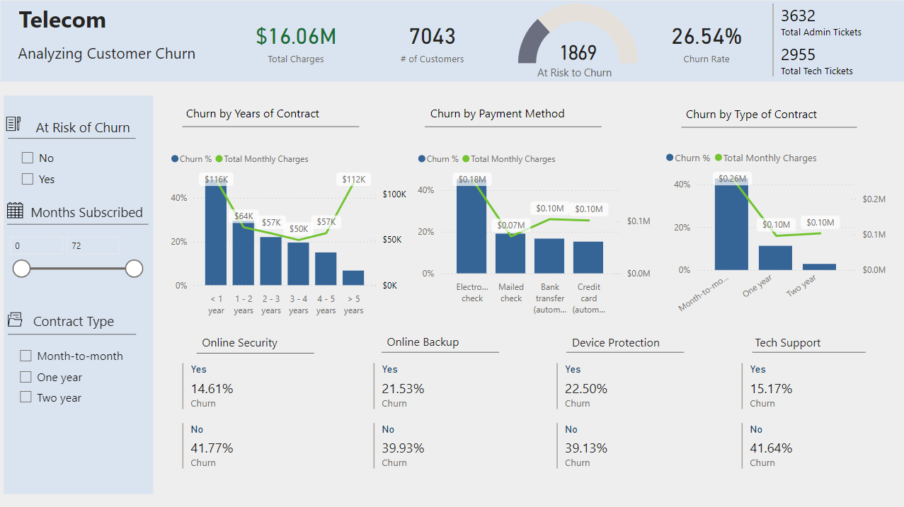

## Customer Retention
#### Description
The retention  department focuses on re-engaging customers who have terminated their contracts. 
The retention manager from the telecom needs a clear and visually intuitive representation of customer data to facilitate management decisions.
This task includes:

\- Defining proper KPIs

\- Creating a dashboard for the retention manager reflecting the KPIs

\- Explaining findings, and including suggestions as to what needs to be changed
#### Data Preparation
The dataset was provided by the company. In addition to basic data cleaning, I modeled the data by splitting it into fact and dimension tables using a star schema design. I also added the following measures:

 At Risk = CALCULATE(COUNTROWS(Fact_Churn), Fact_Churn[Churn] = "Yes")

 Churn % = DIVIDE([At Risk], COUNT(Fact_Churn[Customer Id]))
 
And calculated column:

 Loyalty = SWITCH(TRUE(),
            [Tenure] < 12, "< 1 year",
            [Tenure] < 24, "1 - 2 years",
            [Tenure] < 36, "2 - 3 years",
            [Tenure] < 48, "3 - 4 years",
            [Tenure] < 60, "4 - 5 years",
            TRUE(), "> 5 years")

#### Visualization

#### Key Takeaways
- High Churn in First Year: Customers in their first year have the highest churn rates, which gradually decrease over time. Additionally, those using extra services, specifically online security and technical support, experience lower churn. **Suggestion:** Develop an onboarding process for new customers, including welcome calls, educational emails, and early engagement strategies to enhance their experience and reduce churn.

- Automatic Payment Methods: Customers using automatic payment methods (bank transfer, credit card) are less likely to churn. **Suggestion:** Encourage the use of automatic payment methods by offering benefits such as discounts or bonus features.

- Contract Duration Impact: Month-to-month contracts have significantly higher churn rates compared to one-year and two-year contracts. **Suggestion:** Promote longer-term contracts by emphasizing their benefits and cost savings. Consider offering tailored promotions or loyalty rewards to month-to-month customers to encourage them to switch to longer-term contracts.

**Additional Recommendation:** To enhance customer retention, focus on proactively engaging with customers at risk of terminating their contracts rather than reacting only after they have left. Provide value-adding services and ensure ongoing engagement to address issues before they lead to churn. These practices can help reduce churn rates while boosting customer satisfaction and loyalty.
